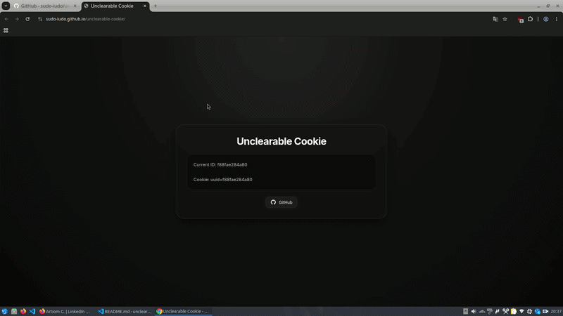

#### Steps to reproduce:

1. Open the [page](https://sudo-iudo.github.io/unclearable-cookie) in Google Chrome
2. Clear the cookies using the popup from the address bar
3. Reload the page

#### Disclaimer:

This method does not work if the cookies are cleared while the tab is closed, or if the tab is closed during cookie clearing. However, it still bypasses the most common cookie-clearing flow in the UI. Most likely, this also works in other browsers. I tested it in Firefox on desktop as well.

#### Legal Disclaimer

This proof of concept is intended for security research and demonstration purposes only. Using similar techniques in production to circumvent user intent or privacy controls may violate applicable laws, platform policies, or regulations.
